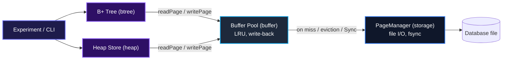

# index_lab

A persistent B+ tree index, built from scratch in Go, to understand how
database indexes actually work — not to build a database.

This project exists because reading about B+ trees, page splits, and
buffer pools (Chapter 3 of *Designing Data-Intensive Applications*) is
not the same as implementing one and watching it behave under load. Go
was chosen specifically because it doesn't abstract away the low-level
details — byte offsets, fixed-size pages, manual encoding — that this
project is meant to teach.

## What's actually in here

- A slotted-page storage format and file-backed `PageManager`
- A full B+ tree: insert, search, delete, and range scan, with leaf
  splitting/merging and multi-level split/underflow propagation
- Composite `(columnA, columnB)` keys, a unique-index constraint, and a
  partial index (indexes only rows matching a predicate)
- A minimal heap file, so the B+ tree can act as a real secondary index
  (`key → RecordID → heap → row`), not just store rows directly
- An LRU buffer pool with write-back caching, sitting between the tree
  and the page manager
- An explicit durability boundary (`Sync()`), separate from ordinary
  writes, so "written" and "durable" are distinguishable operations
- An experiment suite and CLI that measure all of the above under
  different key-generation patterns

See `task.md` for the full original spec, and `FINDINGS.md` for what
the experiments actually showed.

## What's explicitly *not* in here

By design: no SQL parser or query planner, no transactions, no MVCC, no
WAL or crash recovery, no concurrency (no locks/latches — this is
single-threaded throughout), no replication, no networking. This is an
index-and-storage laboratory, not a database.

## Architecture



The buffer pool is optional per tree/heap instance — `btree.Open(path)`
talks straight to the `PageManager`, `btree.Open(path,
btree.WithBufferPool(64))` routes every read/write through the pool
instead. This is what makes the pooled-vs-unpooled experiment possible:
both codepaths exist side by side, not one replacing the other.

### The write-back / durability boundary

`WritePage` only hands bytes to the OS — it does not guarantee they
survive a crash. With a buffer pool configured, a "write" is even
lazier: the page is marked dirty in memory and the actual disk write is
deferred until the page is evicted or `Sync()`/`Close()` is called.

`Sync()` is the explicit, separate operation that flushes any dirty
pages still in the pool and then calls `fsync` on the underlying file.
The point of keeping this separate from ordinary writes is to make the
cost of durability visible and controllable — see the sync-cost
experiment in `FINDINGS.md` for exactly how expensive fsync-per-write
actually is.

## Usage

```go
package main

import (
	"fmt"
	"log"

	"github.com/DanielPopoola/index_lab/internal/btree"
	"github.com/DanielPopoola/index_lab/internal/heap"
)

func main() {
	store, err := heap.Open("data.heap")
	if err != nil {
		log.Fatalf("failed to open heap: %v", err)
	}
	defer store.Close()

	// btree.WithBufferPool(64) here to route through an LRU pool instead.
	index, err := btree.Open("data.index")
	if err != nil {
		log.Fatalf("failed to open index: %v", err)
	}
	defer index.Close()

	recordID, err := store.Put([]byte("sample record"))
	if err != nil {
		log.Fatalf("failed to write to heap: %v", err)
	}

	if err := index.Insert(1042, recordID); err != nil {
		log.Fatalf("failed to index record: %v", err)
	}

	if foundID, ok := index.Search(1042); ok {
		data, _ := store.Get(foundID)
		fmt.Printf("retrieved: %s\n", data)
	}

	// Force everything written so far to durable storage.
	if err := index.Sync(); err != nil {
		log.Fatalf("sync failed: %v", err)
	}
}
```

## Running the experiments

```sh
make build          # go build -o bin/indexlab ./cmd/indexlab
make test           # go test ./...
make run            # run every experiment, N=5000 by default
```

Per-experiment targets, and overridable parameters:

```sh
make run-workload                          # key-pattern vs. tree shape
make run-reads                             # pages touched per operation
make run-writes                            # index write amplification
make run-bufferpool POOL_CAPACITY=2000     # pooled vs. unpooled I/O
make run-sync SYNC_INTERVAL=100            # fsync strategy cost

make run N=200000 POOL_CAPACITY=64 SYNC_INTERVAL=100
```

Or run the binary directly for more control:

```sh
./bin/indexlab -run=bufferpool -n=200000 -pool-capacity=2000
```

## Technologies used

| Category | Technology |
|---|---|
| Language | [Go](https://go.dev/) |
| Techniques | B+ trees, slotted pages, LRU write-back caching, explicit fsync boundary |
| Reference | *Designing Data-Intensive Applications*, Chapter 3 |

## Author

* GitHub: [DanielPopoola](https://github.com/DanielPopoola)