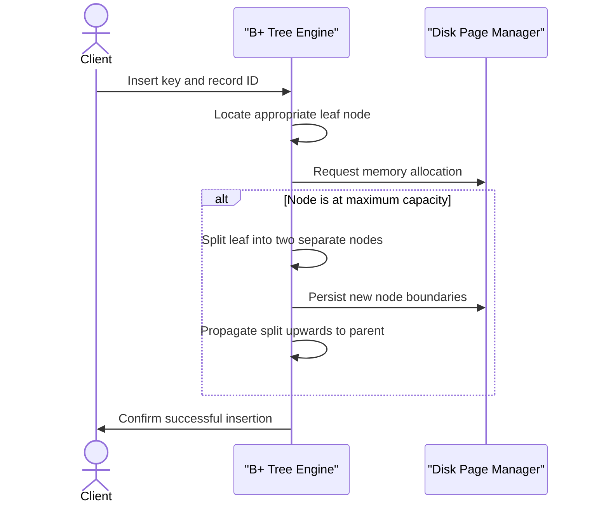
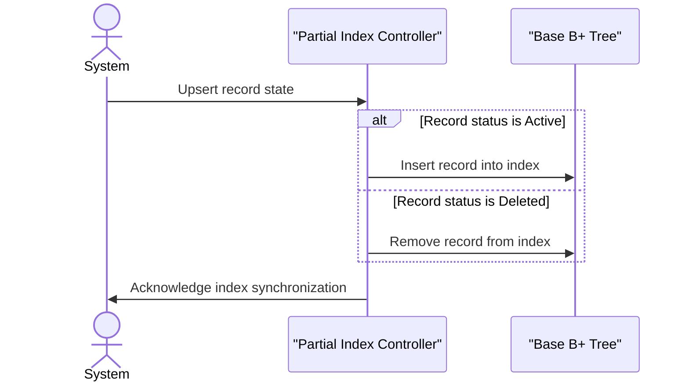

# index_lab

## Overview
This project provides teams with a custom-built, persistent storage engine and indexing system. It manages raw data efficiently while providing fast, structured access through advanced tree structures. The system solves the problem of handling complex data interactions on disk, making it easy to measure and optimize data retrieval workflows without relying on external database management systems.

## System Architecture


## Features

* **Persistent B+ Tree Indexing**: Maintains strict data ordering directly on disk. The tree handles complex node splits, merges, and key redistributions automatically to keep reads and writes exceptionally fast under heavy loads.



* **Heap Storage Engine**: Manages raw row data utilizing fixed-size disk pages. It allocates physical space intelligently and tracks absolute memory addresses to ensure data integrity across system restarts.

* **Composite and Partial Indexes**: Allows developers to index across multiple data columns simultaneously. It also includes partial indexing logic to selectively track only active records, drastically reducing disk footprint.



* **Workload Experimentation Suite**: Generates simulated traffic patterns like sequential inserts or randomized UUID lookups. This allows teams to accurately measure page reads, disk writes, and structural node splits to evaluate true system performance.

## Usage

Integrating the index and heap storage into your application involves opening the relevant disk files, performing operations, and ensuring the connections are properly closed. 

The following snippet demonstrates how to initialize the storage engine, write a raw data row into the heap, and index its physical location using the B+ Tree.

```go
package main

import (
	"fmt"
	"log"

	"github.com/DanielPopoola/index_lab/internal/btree"
	"github.com/DanielPopoola/index_lab/internal/heap"
)

func main() {
	// Initialize the raw heap storage
	store, err := heap.Open("data.heap")
	if err != nil {
		log.Fatalf("Failed to open heap storage: %v", err)
	}
	defer store.Close()

	// Initialize the B+ Tree index
	index, err := btree.Open("data.index")
	if err != nil {
		log.Fatalf("Failed to open index: %v", err)
	}
	defer index.Close()

	// Write raw information to the heap
	recordID, err := store.Put([]byte("sample record information"))
	if err != nil {
		log.Fatalf("Failed to write to heap: %v", err)
	}

	// Link a unique key to the physical record ID in the tree
	err = index.Insert(1042, recordID)
	if err != nil {
		log.Fatalf("Failed to index record: %v", err)
	}

	// Retrieve the data using the index
	foundID, ok := index.Search(1042)
	if ok {
		data, _ := store.Get(foundID)
		fmt.Printf("Successfully retrieved: %s\n", string(data))
	}
}
```

## Technologies Used

| Category | Technology |
|---|---|
| Programming Language | [Go](https://go.dev/) |
| Architecture | B+ Trees, Fixed-size Paging, Disk Management |

## Author

* GitHub: [DanielPopoola](https://github.com/DanielPopoola)

##

[](https://go.dev/)

[](https://dokugen.samueltuoyo.com)